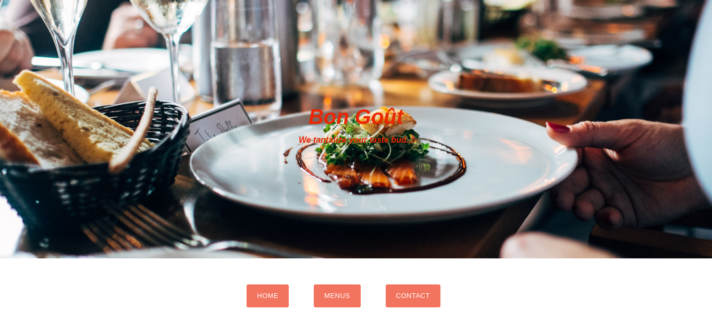
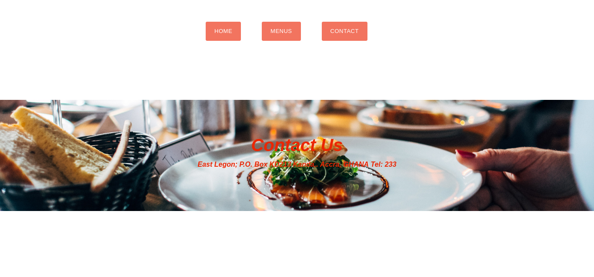
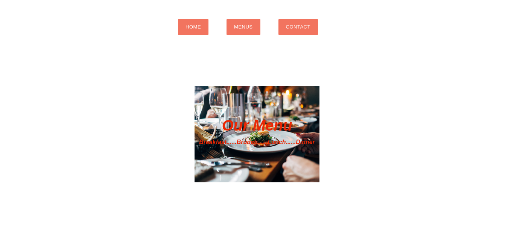

# Restaurant_Page

## Description
A simple restaurant landing page, created with Javascript using webpack's modularized code management. 

The objective is to demonstrate understanding of the benefits of modularized code as well as the ability to set up a javascript application made of different modules using webpack.

The application contains a simple home page with the name of the restaurant and a brief descritption of the restaurant's unique selling proposititon.

Othe pages include the contact and menu pages. All the pages were developed entirely with javascript except for the bare bone HTML skeleton to provide a framework to hold the bundled module scripts in main.js.

### Main page


### Contact page


### Menu page



## Built With
- Javascript.
- HTML.
- CSS.


## Getting Started

To get a local copy, follow these simple example steps.

- Go to the "Code" section of this repository and press the green button that says "Code". Copy the URL or the SSH key.
- Go to the terminal and enter:
```
git clone URL/SSH key
```
- If you don't have git, you can download this project and unzip it.
- Change directory into the folder the application is saved.
- Launch the application from index.html.


## Usage
- Navigate through the respective tabs on the home page to see details for each page.


## Author

👤 **George Gbenle**

- GitHub: [george-shammar](https://github.com/george-shammar)
- Twitter: [@GeorgeShammar](https://twitter.com/GeorgeShammar)
- LinkedIn: [George Gbenle](https://www.linkedin.com/in/georgegbenle/)


## 🤝 Contributing

Contributions, issues and feature requests are welcome!


## Show your support

Give a ⭐️ if you like this project!


## 📝 License

This project is [MIT](LICENSE) licensed.

## Acknowledgments
Pictures from unsplash
