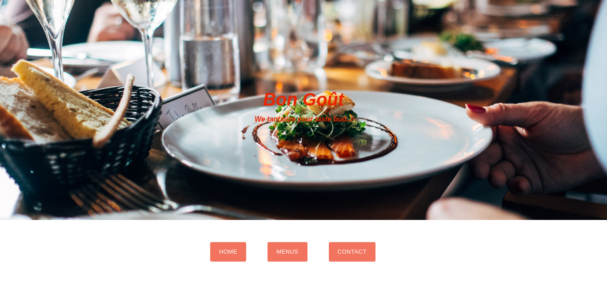

# Restaurant_Page

## Description
A simple restaurant landing page, created with Javascript using webpack's modularized code management. 

The objective is to demonstrate understanding of the benefits of modularized code as well as the ability to set up a javascript application made of different modules using webpack.

The application contains a simple home page with the name of the restaurant and a brief descritption of the restaurant's unique selling proposititon.

### Main page

